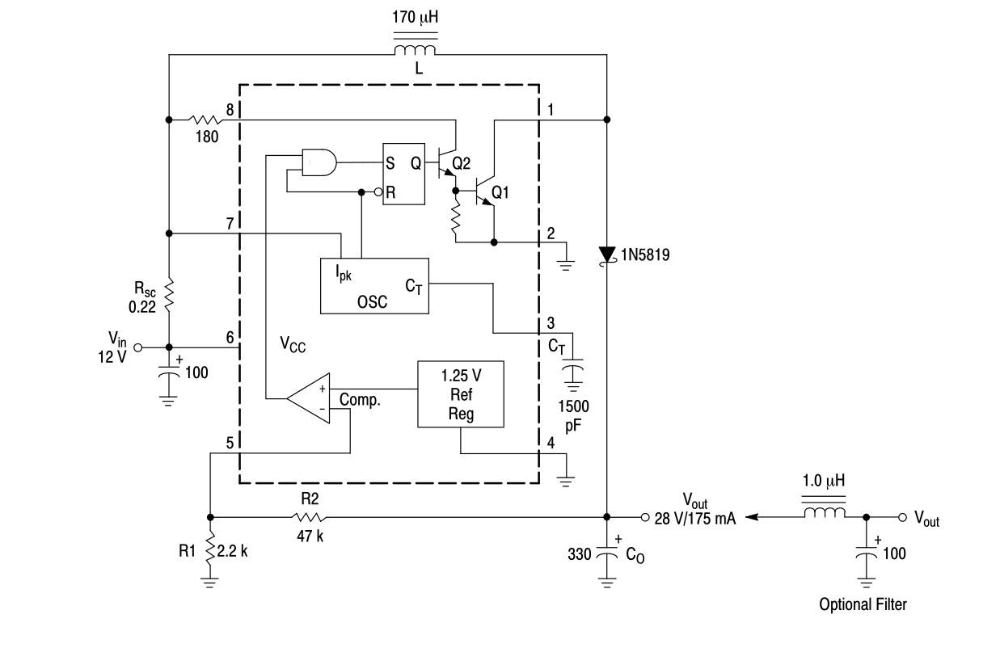
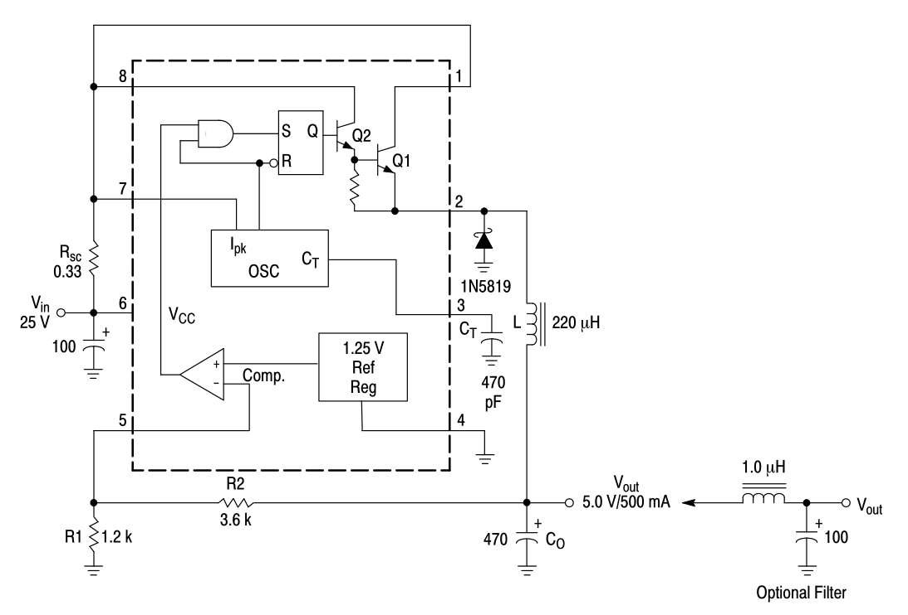

# Расчёт номиналов DC-DC преобразователя на микросхеме MC34063

Вызов программы:

```bash
python3 34063.py 5.0 15.0 200.0
```

Если выходное напряжение больше входного, то используется схема:



Если выходное напряжение меньше входного, то используется схема:


